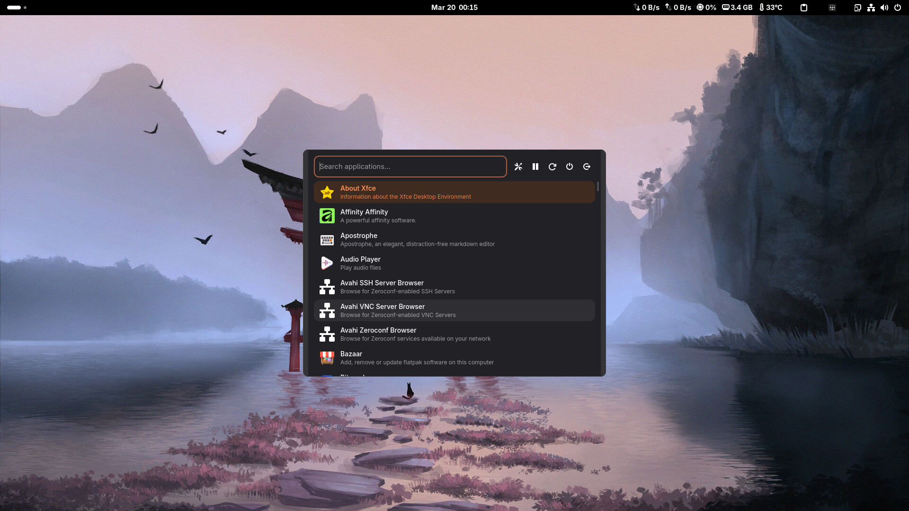
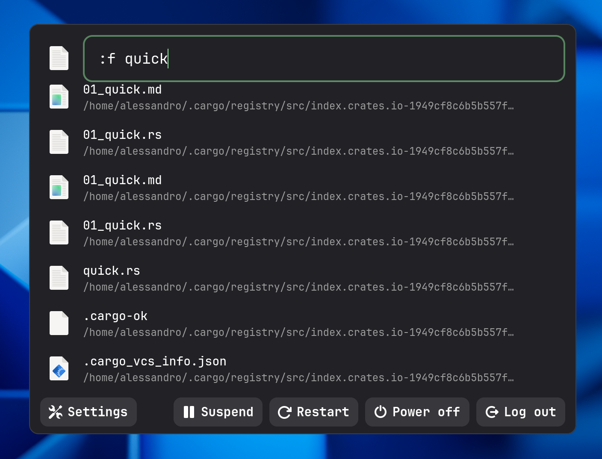
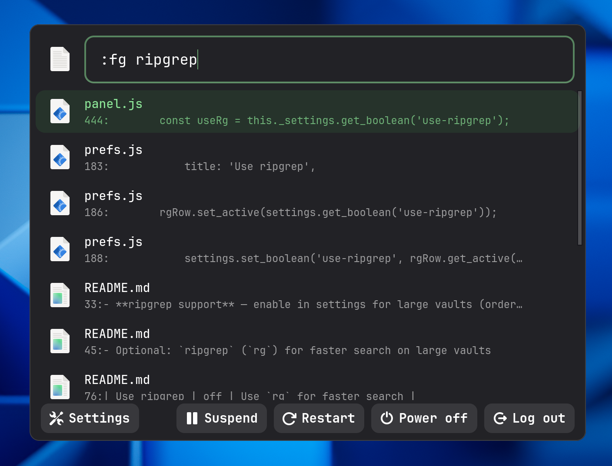
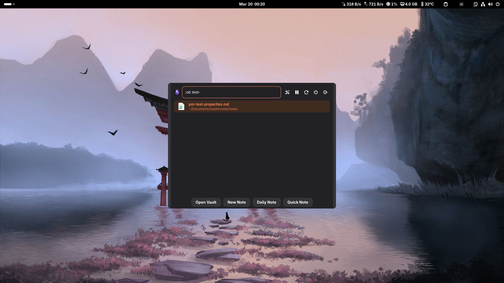
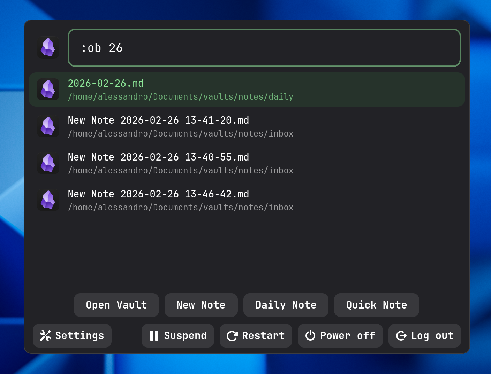
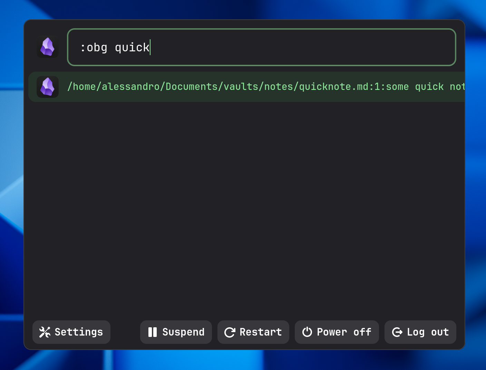
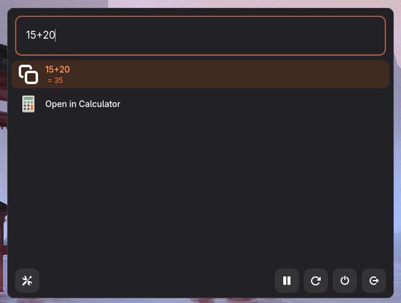
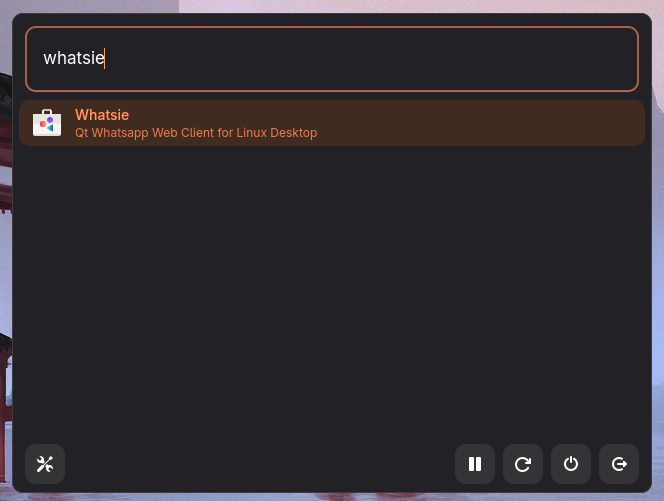

# grunner

A fast, keyboard-driven application launcher for GNOME and other Linux desktops, written in Rust. Inspired by Rofi, grunner is built on GTK4 and libadwaita, and follows your system's light/dark theme and accent color automatically.


---

## Gallery

Take a quick look at grunner in action:

| | |
|---|---|
| **Main window** – fuzzy application search |  |
| **Application filtering** |  |
| **File search** (`:f`) using plocate |  |
| **Full‑text grep** (`:fg`) using ripgrep |  |
| **Obsidian actions** (`:ob`) – vault, new note, daily note, quick note |  |
| **Obsidian file search** (`:ob` with file list) |  |
| **Obsidian vault grep** (`:obg`) |  |
| **GNOME Shell search providers** (`:s`) – files, calculator, etc. |   |

---

## Features

- **Fuzzy application search** — instantly searches all installed `.desktop` applications with fuzzy matching (powered by `skim`)
- **Inline calculator** — evaluate arithmetic expressions directly in the search bar; press Enter to copy the result to the clipboard
- **Colon commands** — extensible command system for file search, full-text grep, GNOME Shell search providers, and Obsidian integration
- **Obsidian integration** — open your vault, create new notes, append to a daily note, or open/search vault files without leaving the keyboard
- **GNOME Shell search providers** — query any installed GNOME Shell search provider (Files, Calculator, GNOME Calendar, etc.) via `:s`
- **Power bar** — suspend, restart, power off, and log out, each with a confirmation dialog
- **Settings shortcut** — opens your config file with `xdg-open` for quick editing
- **Themeable** — uses libadwaita CSS custom properties; automatically adapts to light/dark mode and the user's accent color
- **Configurable** — a single TOML file controls window size, search directories, result limits, calculator toggle, custom commands, debounce timing, and Obsidian paths

---

## Dependencies

### Build dependencies

- **Rust** (edition 2024)
- **GTK4** (≥ 0.10)
- **libadwaita** (≥ 0.8 with `v1_6` feature)

Install them on your distribution:

**Fedora**
```bash
sudo dnf install rust gtk4-devel libadwaita-devel plocate
```

**Ubuntu / Debian**
```bash
sudo apt install rustc cargo libgtk-4-dev libadwaita-1-dev plocate
```

**Arch Linux**
```bash
sudo pacman -S rust gtk4 libadwaita plocate
```

After installing `plocate`, enable its index auto-update so that `:f` searches stay current:

```bash
sudo updatedb
sudo systemctl enable --now plocate-updatedb.timer
```

### Optional runtime tools

| Tool | Used by | Notes |
|---|---|---|
| `plocate` | `:f` file search | Index must be populated via `updatedb` |
| `rg` (ripgrep) | `:fg` full-text grep, `:obg` vault grep | |
| Terminal emulator | Apps with `Terminal=true` | Auto-detected in order: `foot`, `alacritty`, `kitty`, `wezterm`, `ghostty`, `gnome-terminal`, `xfce4-terminal`, `konsole`, `xterm` |
| `obsidian` | `:ob` / `:obg` commands | Must be launchable via `xdg-open obsidian://…` |
| `systemctl` / `loginctl` | Power bar (suspend, reboot, poweroff, logout) | Standard on systemd-based distros |

---

## Installation

### Build from source

```bash
git clone https://github.com/Nihmar/grunner.git
cd grunner
cargo build --release
```

The compiled binary will be at `target/release/grunner`.

### Install to `~/.local/bin`

A convenience script is included:

```bash
bash build.sh
```

This runs `cargo build --release` and copies the binary to `~/.local/bin/grunner`. Make sure `~/.local/bin` is on your `$PATH`.

### Bind to a keyboard shortcut

In GNOME Settings → Keyboard → Custom Shortcuts, add:

| Name | Command | Suggested shortcut |
|---|---|---|
| grunner | `/home/<user>/.local/bin/grunner/grunner` | `Super+Space` or `Alt+F2` |

---

## Usage

Launch `grunner`. The window appears with a search bar focused and ready for input.

### Keyboard shortcuts

| Key | Action |
|---|---|
| Type anything | Filter applications (fuzzy search) |
| `Enter` | Launch selected app / activate selected result |
| `↑` / `↓` | Move selection up / down |
| `Page Up` / `Page Down` | Jump 10 items up / down |
| `Escape` | Close the launcher |

---

## Search modes

### Default — application search

Type any text to fuzzy-search all installed applications. Results are ranked by match score. The app's name, description, and icon are displayed in each row.

### Calculator mode

Enabled via `calculator.enabled = true` in your config. When the search query consists entirely of arithmetic characters (`0–9 . + - * / % ^ ( )`), grunner evaluates the expression live and shows the result as the first item. Press `Enter` to copy the numeric result to the clipboard.

```
7/3         →   = 2.333333
(12 + 8)*5  →   = 100
```

Integer literals are automatically promoted to floats so that `7/2` yields `3.5`, not `3`. Partial expressions are evaluated as you type.

### Colon commands

Type `:` followed by a command name and an optional argument:

```
:<command> [argument]
```

#### `:f <pattern>` — file search

Searches your home directory using `plocate` (case-insensitive). Results are displayed with the filename as the title and the parent directory as the subtitle. Press `Enter` to open the file with `xdg-open` or, for text files, with `$EDITOR` at the matched line.

```
:f invoice 2024
```

#### `:fg <pattern>` — full-text grep

Searches file contents recursively under `~` using `ripgrep`. Results are displayed in `file:line:content` format with the filename as the title. Press `Enter` to open the file at the matching line in `$EDITOR`.

```
:fg TODO fixme
```

#### `:s <query>` — GNOME Shell search providers

Queries all installed and enabled GNOME Shell search providers in parallel (e.g., GNOME Files, GNOME Calendar, GNOME Contacts). Results from all providers are merged and displayed with the provider's icon. Press `Enter` to activate the result through the provider's D-Bus interface.

```
:s meeting notes
```

#### `:ob [text]` — Obsidian actions

Requires `[obsidian]` to be configured (see [Configuration](#configuration)). Displays an action bar with four buttons:

| Button | Action |
|---|---|
| **Open Vault** | Opens the configured vault in Obsidian |
| **New Note** | Creates a new timestamped note in `new_notes_folder`, optionally pre-filled with `[text]`, then opens it |
| **Daily Note** | Opens (or creates) today's daily note in `daily_notes_folder`, optionally appending `[text]` |
| **Quick Note** | Appends `[text]` to the configured `quick_note` file, then opens it |

```
:ob pick up milk
```

Selecting a result from the list opens that vault file directly in Obsidian.

#### `:obg <pattern>` — Obsidian vault grep

Searches the content of all Markdown files in your vault using `rg`. Results show the matching line. Press `Enter` to open the file at that line in Obsidian.

```
:obg project alpha
```

#### Custom commands

You can define your own colon commands in the config file. Each command receives the argument after the command name as `$1` in a shell invocation. Output lines are shown in the results list; selecting a line attempts to open it as a file or copy it to the clipboard.

```toml
[commands]
gh = "gh search repos \"$1\" --limit 10 --json fullName -q '.[].fullName' 2>/dev/null"
```

Usage: `:gh neovim`

---

## Configuration

grunner stores its configuration at `~/.config/grunner/grunner.toml`. The file is created automatically with defaults on first run. You can open it from within grunner by clicking the **Settings** button in the bottom-left of the window.

All keys are optional; missing keys fall back to built-in defaults.

### Full example

```toml
# grunner configuration

[window]
# Width and height of the launcher window in pixels.
width  = 640
height = 480

[search]
# Maximum number of results shown when a query is active.
max_results = 64

# Delay in milliseconds before executing a colon command after you stop typing.
# Lower values feel more responsive; higher values reduce flicker for slow commands.
command_debounce_ms = 300

# Directories scanned for .desktop files.
# Use ~ for the home directory. Non-existent directories are silently skipped.
app_dirs = [
    "/usr/share/applications",
    "/usr/local/share/applications",
    "~/.local/share/applications",
    "/var/lib/flatpak/exports/share/applications",
    "~/.local/share/flatpak/exports/share/applications",
]

[calculator]
# Enable inline expression evaluation.
enabled = false

[commands]
# Built-in defaults (shown here for reference; override freely).
f  = "plocate -i -- \"$1\" 2>/dev/null | grep \"^$HOME/\" | head -20"
fg = "rg --with-filename --line-number --no-heading -S \"$1\" ~ 2>/dev/null | head -20"

[obsidian]
# Absolute or ~ path to the root of your Obsidian vault.
vault = "~/Documents/Obsidian/MyVault"
# Subfolder inside the vault where daily notes are stored.
daily_notes_folder = "Daily"
# Subfolder inside the vault where new notes are created.
new_notes_folder = "Inbox"
# Path to the quick-note file, relative to the vault root.
quick_note = "Quick.md"
```

### Configuration reference

| Key | Type | Default | Description |
|---|---|---|---|
| `window.width` | integer | `640` | Window width in pixels |
| `window.height` | integer | `480` | Window height in pixels |
| `search.max_results` | integer | `64` | Maximum results displayed |
| `search.command_debounce_ms` | integer | `300` | Debounce delay for colon commands (ms) |
| `search.app_dirs` | array of strings | (see above) | Directories to scan for `.desktop` files |
| `calculator.enabled` | boolean | `false` | Enable inline calculator |
| `commands.<name>` | string | (see above) | Shell command for a custom colon command |
| `obsidian.vault` | string | — | Path to Obsidian vault root |
| `obsidian.daily_notes_folder` | string | — | Daily notes subfolder |
| `obsidian.new_notes_folder` | string | — | New notes subfolder |
| `obsidian.quick_note` | string | — | Quick-note file path (relative to vault) |

---

## Architecture overview

| File | Purpose |
|---|---|
| `main.rs` | Entry point; loads config, creates the GTK application, and calls `build_ui` |
| `ui.rs` | Builds the GTK4/libadwaita window, entry bar, list view, Obsidian action bar, and power bar |
| `list_model.rs` | Central search model; dispatches queries to the correct mode and populates the `ListStore` |
| `launcher.rs` | Scans `.desktop` files, parses them, and deduplicates entries |
| `calculator.rs` | Arithmetic expression evaluator (wraps `evalexpr`); handles integer-to-float promotion |
| `search_provider.rs` | D-Bus client for GNOME Shell search providers (discovery + query + activation) |
| `actions.rs` | Side-effectful actions: launching apps, power commands, opening files, Obsidian URIs |
| `config.rs` | TOML config loading with defaults and `~` expansion |
| `app_item.rs` | GObject wrapper for application entries |
| `calc_item.rs` | GObject wrapper for calculator results |
| `cmd_item.rs` | GObject wrapper for command output lines |
| `obsidian_item.rs` | GObject wrapper for Obsidian action entries |
| `search_result_item.rs` | GObject wrapper for GNOME Shell search provider results |
| `style.css` | libadwaita CSS using `var(--accent-color)` and `var(--window-bg-color)` |

---

## Theming

Styles are defined in `style.css` and embedded in the binary at compile time. grunner uses libadwaita 1.6+ CSS custom properties, so it automatically inherits the system light/dark preference and accent color without any extra configuration. To apply custom styles, modify `src/style.css` and recompile.

---

## License

This project is licensed under the [MIT License](LICENSE).
