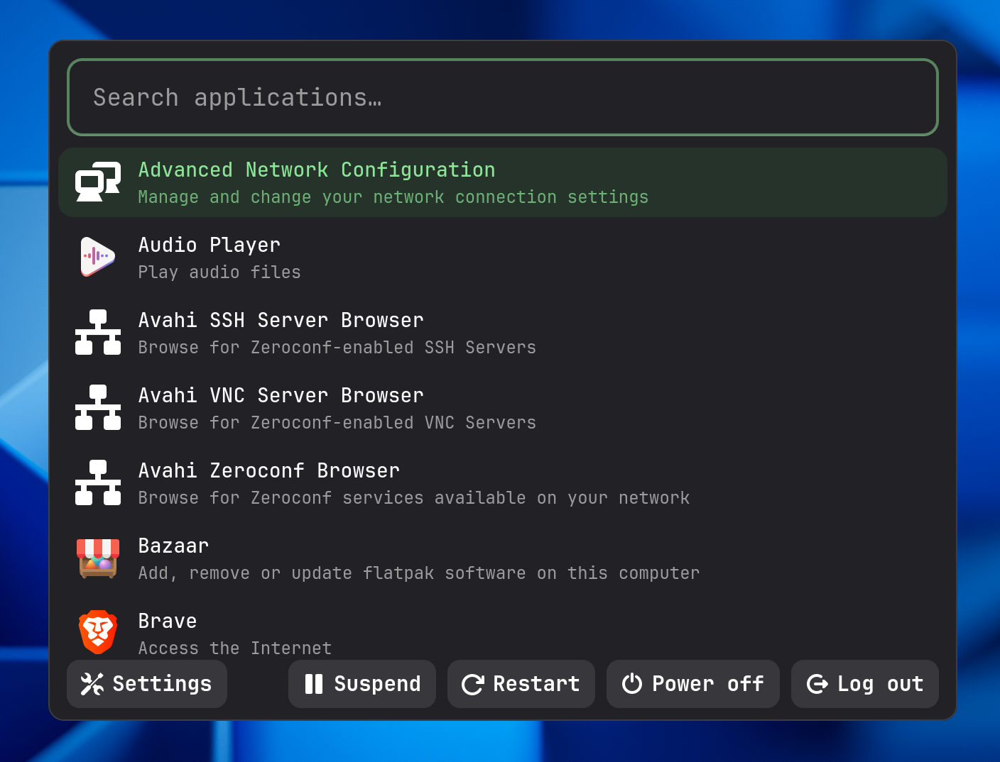
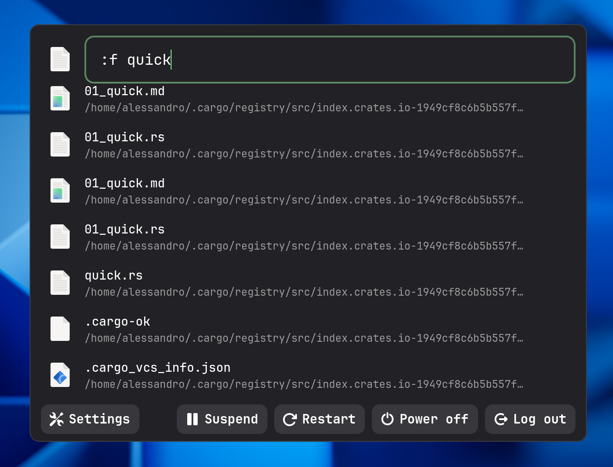
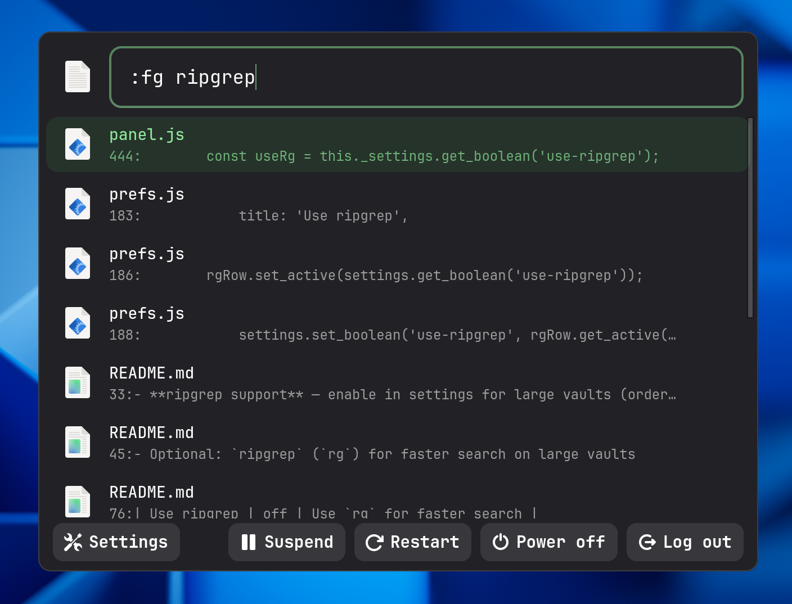
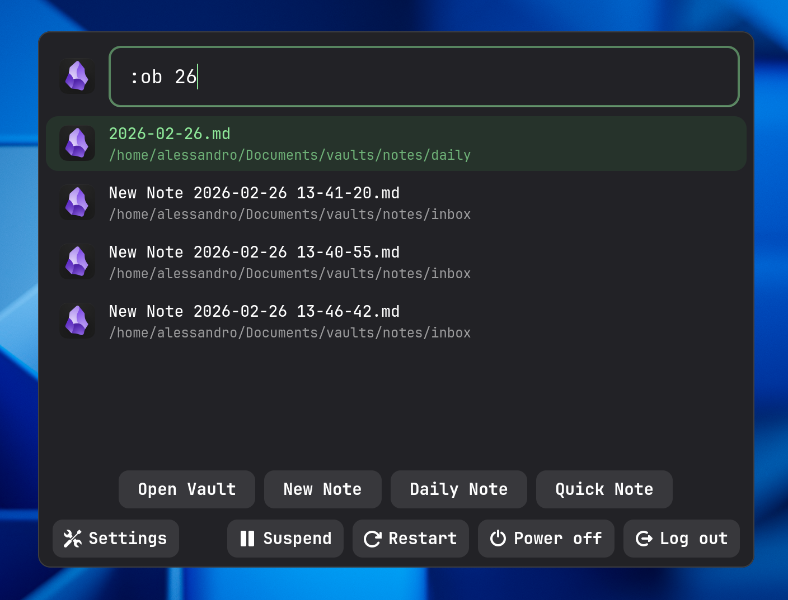
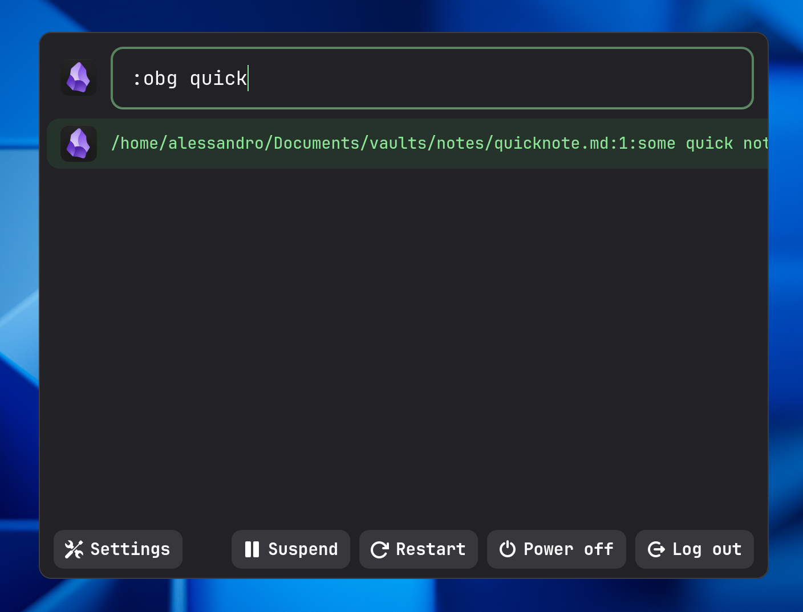
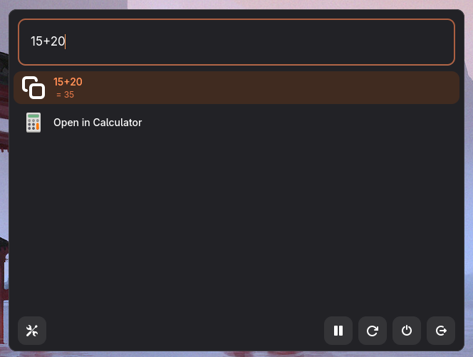
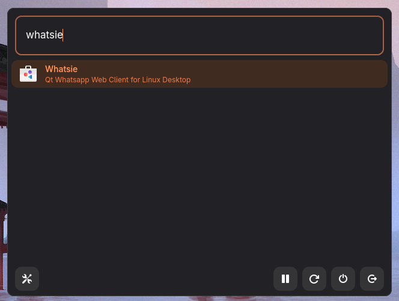

# grunner

A fast, keyboard-driven application launcher for GNOME and other Linux desktops, written in Rust. Inspired by Rofi, grunner is built on GTK4 and libadwaita, and follows your system's light/dark theme and accent color automatically.


**📚 [Comprehensive Documentation](docs/README.md) available in the `docs/` directory**

---

## Gallery

Take a quick look at grunner in action:

| | |
|---|---|
| **Main window** – fuzzy application search |  |
| **Application filtering** |  |
| **File search** (`:f`) with fallback support |  |
| **Full‑text grep** (`:fg`) with fallback support |  |
| **Obsidian actions** (`:ob`) – vault, new note, daily note, quick note |  |
| **Obsidian file search** (`:ob` with file list) |  |
| **Obsidian vault grep** (`:obg`) |  |
| **GNOME Shell search providers** (`:s`) – files, calendar, contacts, etc. |   |

---

## Features

- **Fuzzy application search** — instantly searches all installed `.desktop` applications with fuzzy matching (powered by `skim`)
- **Colon commands** — built-in fixed commands for file search (:f), full-text grep (:fg), GNOME Shell search providers (:s), and Obsidian integration (:ob, :obg), plus custom user-defined commands
- **Obsidian integration** — open your vault, create new notes, append to a daily note, or open/search vault files without leaving the keyboard
- **GNOME Shell search providers** — query any installed GNOME Shell search provider (Files, GNOME Calendar, GNOME Contacts, etc.) via `:s`
- **Power bar** — suspend, restart, power off, and log out, each with a confirmation dialog
- **Settings shortcut** — opens your config file with `xdg-open` for quick editing
- **Themeable** — uses libadwaita CSS custom properties; automatically adapts to light/dark mode and the user's accent color
- **Configurable** — a single TOML file controls window size, search directories, result limits, user-defined custom commands, debounce timing, and Obsidian paths
- **Comprehensive logging** — integrated logging system with journald, syslog, file, and stderr backends, configurable via environment variables with panic capture for debugging

---

## Dependencies

### Build dependencies

- **Rust** (edition 2024)
- **GTK4** (≥ 0.10)
- **libadwaita** (≥ 0.8 with `v1_6` feature)

Install them on your distribution:

**Fedora**
```bash
sudo dnf install rust gtk4-devel libadwaita-devel
```

**Ubuntu / Debian**
```bash
sudo apt install rustc cargo libgtk-4-dev libadwaita-1-dev
```

**Arch Linux**
```bash
sudo pacman -S rust gtk4 libadwaita
```

For optimal performance with `:f` file search, install `plocate` and enable its index auto-update (falls back to `find` if not available):

```bash
sudo updatedb
sudo systemctl enable --now plocate-updatedb.timer
```

### Optional runtime tools

| Tool | Used by | Notes |
|---|---|---|
| `plocate` | `:f` file search | Preferred tool; falls back to `find` if not available. Index must be populated via `updatedb` for best performance. |
| `rg` (ripgrep) | `:fg` full-text grep, `:obg` vault grep | Preferred tool; falls back to `grep` if not available. |
| Terminal emulator | Apps with `Terminal=true` | Auto-detected in order: `foot`, `alacritty`, `kitty`, `wezterm`, `ghostty`, `gnome-terminal`, `xfce4-terminal`, `konsole`, `xterm` |
| `obsidian` | `:ob` / `:obg` commands | Must be launchable via `xdg-open obsidian://…` |
| `systemctl` / `loginctl` | Power bar (suspend, reboot, poweroff, logout) | Standard on systemd-based distros |

---

## Installation

### Using Cargo (Recommended for developers)

```bash
git clone https://github.com/Nihmar/grunner.git
cd grunner
cargo build --release
```

The compiled binary will be at `target/release/grunner`. You can run it directly from there or install it system-wide:

```bash
# Install to ~/.cargo/bin (if it's in your PATH)
cargo install --path .

# Or copy to ~/.local/bin
cp target/release/grunner ~/.local/bin/
```

### Using AUR (Arch Linux)

For Arch Linux users, you can install from the AUR: [grunner-git](https://aur.archlinux.org/packages/grunner-git)

Using your preferred AUR helper:

```bash
# Using yay
yay -S grunner-git

# Using paru
paru -S grunner-git
```

Or manually build and install from the AUR:

```bash
git clone https://aur.archlinux.org/grunner-git.git
cd grunner-git
makepkg -si
```

### Bind to a keyboard shortcut

In GNOME Settings → Keyboard → Custom Shortcuts, add:

| Name | Command | Suggested shortcut |
|---|---|---|
| grunner | `grunner` | `Super+Space` or `Alt+F2` |

---

## Usage

Launch `grunner`. The window appears with a search bar focused and ready for input.

### Keyboard shortcuts

| Key | Action |
|---|---|
| Type anything | Filter applications (fuzzy search) |
| `Enter` | Launch selected app / activate selected result |
| `↑` / `↓` | Move selection up / down |
| `Page Up` / `Page Down` | Jump 10 items up / down |
| `Escape` | Close the launcher |

---

## Search modes

### Default — application search

Type any text to fuzzy-search all installed applications. Results are ranked by match score. The app's name, description, and icon are displayed in each row.

### Colon commands

Type `:` followed by a command name and an optional argument:

```
:<command> [argument]
```

#### `:f <pattern>` — file search (built-in fixed command)

Searches your home directory using `plocate` if available, falling back to `find` otherwise (case-insensitive). Results are displayed with the filename as the title and the parent directory as the subtitle. Press `Enter` to open the file with `xdg-open` or, for text files, with `$EDITOR` at the matched line.

```
:f invoice 2024
```

#### `:fg <pattern>` — full-text grep (built-in fixed command)

Searches file contents recursively under `~` using `ripgrep` if available, falling back to `grep` otherwise. Results are displayed in `file:line:content` format with the filename as the title. Press `Enter` to open the file at the matching line in `$EDITOR`.

```
:fg TODO fixme
```

#### `:s <query>` — GNOME Shell search providers (built-in fixed command)

Queries all installed and enabled GNOME Shell search providers in parallel (e.g., GNOME Files, GNOME Calendar, GNOME Contacts). Results from all providers are merged and displayed with the provider's icon. Press `Enter` to activate the result through the provider's D-Bus interface.

```
:s meeting notes
```

#### `:ob [text]` — Obsidian actions (built-in fixed command)

Requires `[obsidian]` to be configured (see [Configuration](#configuration)). Displays an action bar with four buttons:

| Button | Action |
|---|---|
| **Open Vault** | Opens the configured vault in Obsidian |
| **New Note** | Creates a new timestamped note in `new_notes_folder`, optionally pre-filled with `[text]`, then opens it |
| **Daily Note** | Opens (or creates) today's daily note in `daily_notes_folder`, optionally appending `[text]` |
| **Quick Note** | Appends `[text]` to the configured `quick_note` file, then opens it |

```
:ob pick up milk
```

Selecting a result from the list opens that vault file directly in Obsidian.

#### `:obg <pattern>` — Obsidian vault grep (built-in fixed command)

Searches the content of all Markdown files in your vault using `rg` if available, falling back to `grep` otherwise. Results show the matching line. Press `Enter` to open the file at that line in Obsidian.

```
:obg project alpha
```

#### Custom commands

The following colon commands are built-in and cannot be overridden: `:f`, `:fg`, `:s`, `:ob`, `:obg`. You can define additional custom colon commands in the config file. Each command receives the argument after the command name as `$1` in a shell invocation. Output lines are shown in the results list; selecting a line attempts to open it as a file or copy it to the clipboard.

```toml
[commands]
gh = "gh search repos \"$1\" --limit 10 --json fullName -q '.[].fullName' 2>/dev/null"
```

Usage: `:gh neovim`

---

## Configuration

grunner stores its configuration at `~/.config/grunner/grunner.toml`. The file is created automatically with defaults on first run. You can open it from within grunner by clicking the **Settings** button in the bottom-left of the window.

All keys are optional; missing keys fall back to built-in defaults.

### Full example

```toml
[window]
# Width and height of the launcher window in pixels.
width  = 640
height = 480

[search]
# Maximum number of results shown when a query is active.
max_results = 64

# Delay in milliseconds before executing a colon command after you stop typing.
# Lower values feel more responsive; higher values reduce flicker for slow commands.
command_debounce_ms = 300

# Directories scanned for .desktop files.
# Use ~ for the home directory. Non-existent directories are silently skipped.
app_dirs = [
    "/usr/share/applications",
    "/usr/local/share/applications",
    "~/.local/share/applications",
    "/var/lib/flatpak/exports/share/applications",
    "~/.local/share/flatpak/exports/share/applications",
]

# List of GNOME Shell search providers to exclude.
# provider_blacklist = [
#     "org.gnome.Software.desktop",
#     "org.gnome.Characters.desktop",
# ]


[commands]
# Define additional custom colon commands. Built-in commands (:f, :fg, :s, :ob, :obg) cannot be overridden.
# Example:
# gh = "gh search repos \"$1\" --limit 10 --json fullName -q '.[].fullName' 2>/dev/null"

[obsidian]
# Absolute or ~ path to the root of your Obsidian vault.
vault = "~/Documents/Obsidian/MyVault"
# Subfolder inside the vault where daily notes are stored.
daily_notes_folder = "Daily"
# Subfolder inside the vault where new notes are created.
new_notes_folder = "Inbox"
# Path to the quick-note file, relative to the vault root.
quick_note = "Quick.md"
```

### Configuration reference

| Key | Type | Default | Description |
|---|---|---|---|
| `window.width` | integer | `640` | Window width in pixels |
| `window.height` | integer | `480` | Window height in pixels |
| `search.max_results` | integer | `64` | Maximum results displayed |
| `search.command_debounce_ms` | integer | `300` | Debounce delay for colon commands (ms) |
| `search.app_dirs` | array of strings | (see above) | Directories to scan for `.desktop` files |
| `search.provider_blacklist` | array of strings | `[]` | List of GNOME Shell search providers to exclude |

| `commands.<name>` | string | — | Shell command for additional custom colon commands (built-in :f, :fg, :s, :ob, :obg cannot be overridden) |
| `obsidian.vault` | string | — | Path to Obsidian vault root |
| `obsidian.daily_notes_folder` | string | — | Daily notes subfolder |
| `obsidian.new_notes_folder` | string | — | New notes subfolder |
| `obsidian.quick_note` | string | — | Quick-note file path (relative to vault) |

### Logging Configuration

Grunner includes a comprehensive logging system that can be configured via environment variables. The logging system supports multiple backends (journald, syslog, file, stderr) and log levels.

**Environment Variables:**
```bash
# Log destination (journal, syslog, file, stderr, none)
export GRUNNER_LOG=journal

# Log level (error, warn, info, debug, trace)
export GRUNNER_LOG_LEVEL=info

# Custom log file path (for file logging)
export GRUNNER_LOG_FILE=~/grunner.log
```

**Log Backends:**
- **journald** (default on systemd systems): Logs to systemd journal, view with `journalctl -t grunner`
- **syslog**: Traditional syslog on non-systemd systems
- **file**: File-based logging to `~/.cache/grunner/grunner.log` by default
- **stderr**: Standard error output for development
- **none**: Disable all logging

For complete logging documentation, see [ERROR_LOGGING.md](docs/ERROR_LOGGING.md).

---

## Documentation

Comprehensive documentation is available in the `docs/` directory:

### For Users
- **[User Guide](docs/USER_GUIDE.md)** - Installation, configuration, and usage instructions
- **[Deployment Guide](docs/DEPLOYMENT.md)** - System requirements and deployment options

### For Developers
- **[Architecture Documentation](docs/ARCHITECTURE.md)** - System design and module dependencies
- **[API Reference](docs/API.md)** - Complete API documentation for all modules
- **[Development Guide](docs/DEVELOPMENT.md)** - Development environment setup and contribution guidelines

### Overview
- **[Project Overview](docs/OVERVIEW.md)** - High-level project summary and technology stack

---

## Architecture overview

| File | Purpose |
|---|---|
| `main.rs` | Entry point; loads config, creates the GTK application, and calls `build_ui` |
| `ui.rs` | Builds the GTK4/libadwaita window, entry bar, list view, Obsidian action bar, and power bar |
| `list_model.rs` | Central search model; dispatches queries to the correct mode and populates the `ListStore` |
| `launcher.rs` | Scans `.desktop` files, parses them, and deduplicates entries |
| `app_mode.rs` | Application mode detection and management (Normal, FileSearch, SearchProvider, Obsidian) |
| `item_activation.rs` | Item activation logic based on item type and application mode |
| `obsidian_bar.rs` | Obsidian action bar UI component with buttons for vault operations |
| `power_bar.rs` | Power action bar UI component with system management buttons |
| `settings_window.rs` | Settings dialog UI with configuration editing and validation |
| `utils.rs` | Utility functions for path expansion, shell escaping, and home directory resolution |

| `search_provider.rs` | D-Bus client for GNOME Shell search providers (discovery + query + activation) |
| `actions.rs` | Side-effectful actions: launching apps, power commands, opening files, Obsidian URIs |
| `config.rs` | TOML config loading with defaults and `~` expansion |
| `logging.rs` | Logging configuration and initialization with journald, syslog, file, and stderr backends |
| `app_item.rs` | GObject wrapper for application entries |
| `cmd_item.rs` | GObject wrapper for command output lines |
| `obsidian_item.rs` | GObject wrapper for Obsidian action entries |
| `search_result_item.rs` | GObject wrapper for GNOME Shell search provider results |
| `style.css` | libadwaita CSS using `var(--accent-color)` and `var(--window-bg-color)` |

---


## Theming

Styles are defined in `style.css` and embedded in the binary at compile time. grunner uses libadwaita 1.6+ CSS custom properties, so it automatically inherits the system light/dark preference and accent color without any extra configuration. To apply custom styles, modify `src/style.css` and recompile.

---

## License

This project is licensed under the [MIT License](LICENSE).
