# grunner

A fast, keyboard-driven application launcher for GNOME and other Linux desktops, written in Rust. Inspired by Rofi, grunner is built on GTK4 and libadwaita, and follows your system's light/dark theme and accent color automatically.

**Version:** 3.0.0

---

## Gallery

| Screenshot | Description |
| ---------- | ----------- |
|  | **Application search** — fuzzy-match installed apps |
| 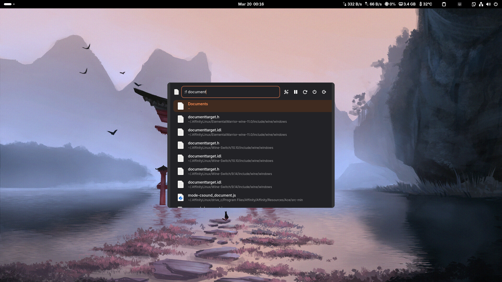 | **File search** (`:f`) — locate files via `plocate` |
| 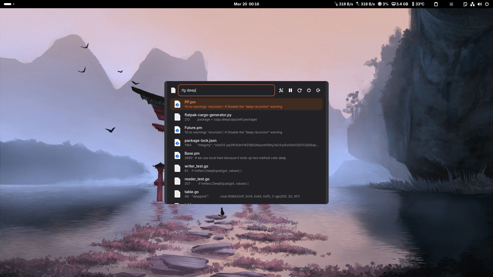 | **Full-text grep** (`:fg`) — search file contents via `ripgrep` |
|  | **Obsidian actions** (`:ob`) — vault, new note, daily note, quick note |
| 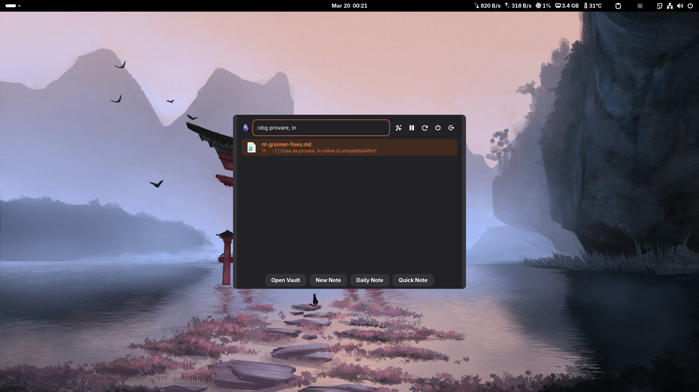 | **Obsidian vault grep** (`:obg`) — search vault file contents |
|  | **Pinned apps** — sidebar favourites with `Alt+1..9` shortcuts |
| 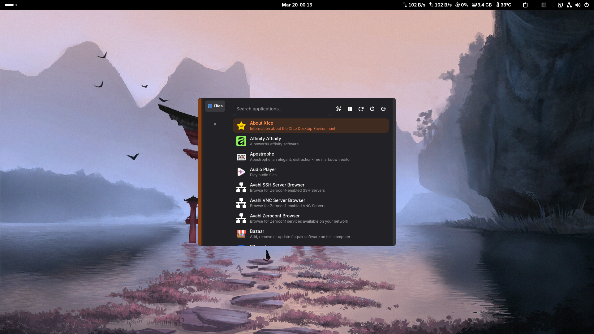 | **Workspace bar** — open windows on the current workspace |
| 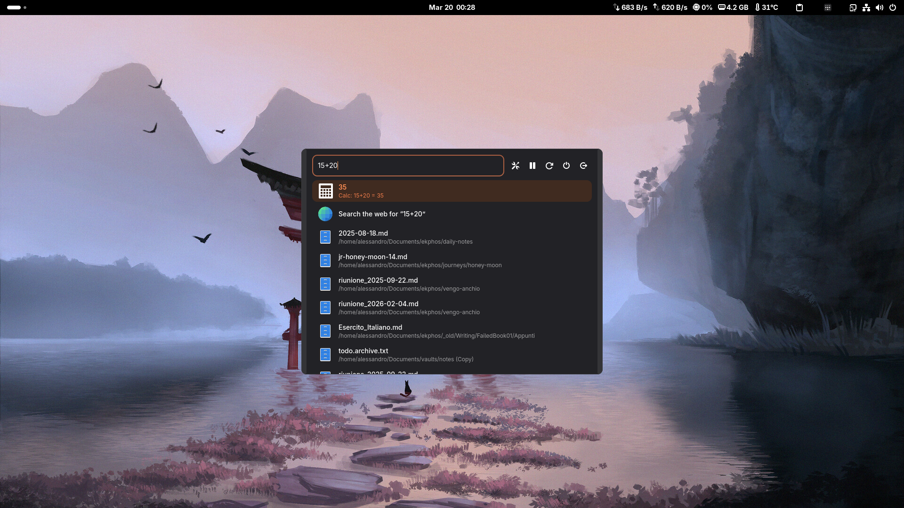 | **Calculator fallback** — auto-evaluate math expressions, Enter to copy |
|  | **GNOME Shell search providers** — files, calendar, contacts, etc. |
| 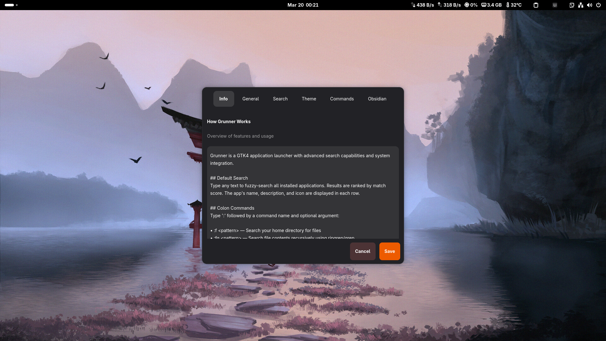 | **Settings** — Info tab |
| 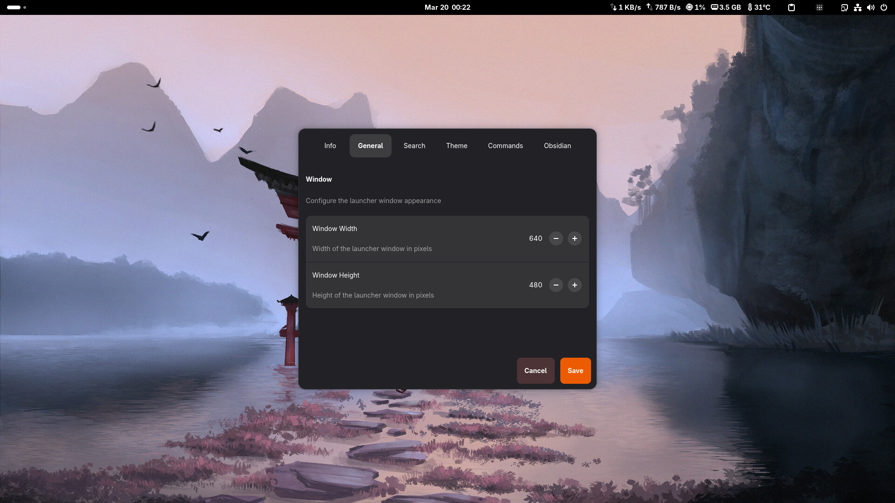 | **Settings** — General tab (window size, workspace bar toggle) |
|  | **Settings** — Search tab (app dirs, debounce, provider blacklist) |
| 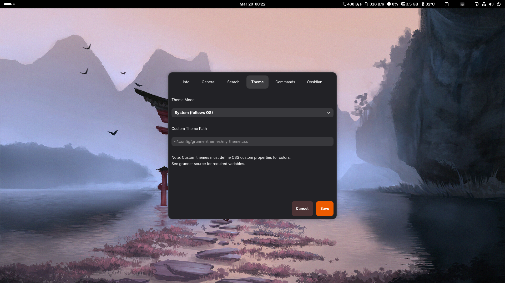 | **Settings** — Theme tab (built-in theme selection) |
| 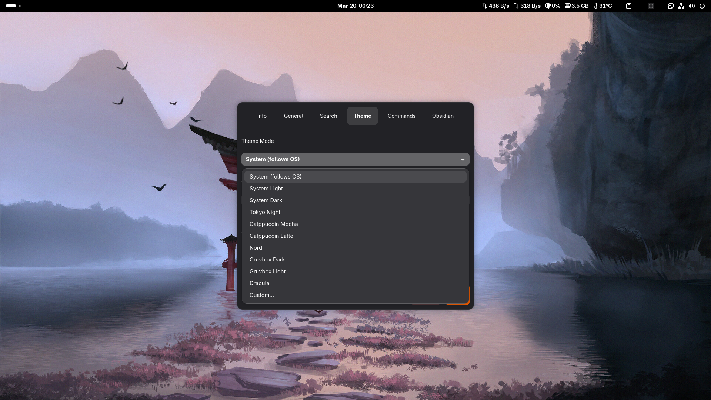 | **Settings** — Theme tab (custom CSS editor) |
| 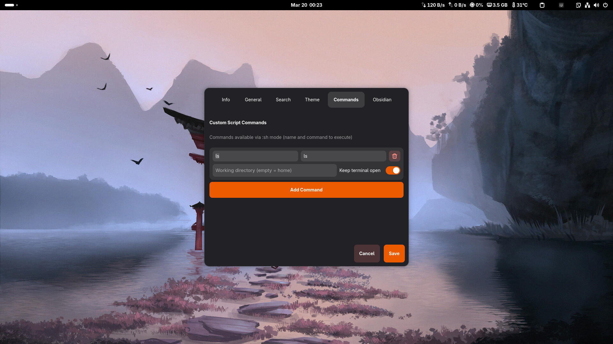 | **Settings** — Commands tab (custom shell commands) |
| 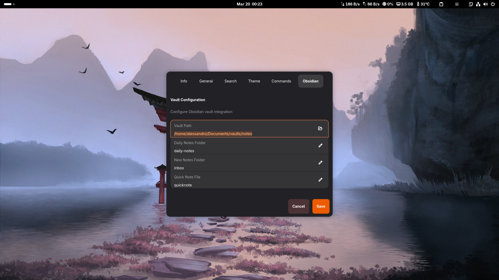 | **Settings** — Obsidian tab (vault paths, daily/quick notes) |

---

## Features

- **Fuzzy application search** — searches all installed `.desktop` applications with fuzzy matching (powered by `skim`)
- **App list cache** — `.desktop` files are scanned once with `jwalk` + `rayon` and cached as binary (`~/.cache/grunner/apps.bin`). The cache is automatically invalidated and rebuilt when application directories change
- **Calculator fallback** — automatically evaluates mathematical expressions; press Enter to copy the result to clipboard
- **Colon commands** — built-in commands for file search (`:f`), full-text grep (`:fg`), and Obsidian integration (`:ob`, `:obg`)
- **Terminal commands (`:sh`)** — run custom shell commands from the launcher; configure in settings or TOML config
- **Obsidian integration** — open your vault, create notes, append to daily notes, or search vault files
- **GNOME Shell search providers** — query installed GNOME Shell search providers (Files, Calendar, Contacts, etc.) inline with app search
- **Workspace bar** — shows open windows on the current workspace; requires the [window-calls](https://extensions.gnome.org/extension/4724/window-calls/) GNOME Shell extension
- **Pinned apps** — right-sidebar strip of favorite apps with `Alt+1`..`9` shortcuts
- **Context menu** — right-click any search result for quick actions (copy, open containing folder, add to favourites, etc.)
- **Power bar** — suspend, restart, power off, and log out with confirmation dialogs
- **Settings window** — graphical dialog with tabs for editing configuration; hot-reload on save
- **Themeable** — 10 built-in themes or load a custom CSS file
- **Configurable** — single TOML file (`~/.config/grunner/grunner.toml`) controls window size, search directories, debounce timing, custom commands, and more
- **Comprehensive logging** — systemd journal, syslog, file, or stderr backends, configurable via environment variables

---

## Dependencies

Tested on Arch Linux. Instructions for other distros may vary.

### Build dependencies

- **Rust** (edition 2024)
- **GTK4** (≥ 0.11)
- **libadwaita** (≥ 0.9 with `v1_6` feature)

**Arch Linux:**

```bash
sudo pacman -S rust gtk4 libadwaita
```

For best `:f` file search performance, install `plocate` and enable its index:

```bash
sudo updatedb
sudo systemctl enable --now plocate-updatedb.timer
```

For best `:fg` performance, install `ripgrep`.

### Optional runtime tools

| Tool                     | Used by                                 | Notes                                                                                                                          |
| ------------------------ | --------------------------------------- | ------------------------------------------------------------------------------------------------------------------------------ |
| `plocate`                | `:f` file search                        | Preferred; falls back to `find` if unavailable. Run `updatedb` to populate the index.                                          |
| `rg` (ripgrep)           | `:fg` full-text grep, `:obg` vault grep | Preferred; falls back to `grep` if unavailable.                                                                                |
| Terminal emulator        | Apps with `Terminal=true`               | Auto-detected: `foot`, `alacritty`, `kitty`, `wezterm`, `ghostty`, `gnome-terminal`, `xfce4-terminal`, `konsole`, `xterm`     |
| `obsidian`               | `:ob` / `:obg` commands                 | Must be launchable via `xdg-open obsidian://…`                                                                                 |
| `systemctl` / `loginctl` | Power bar                               | Standard on systemd-based distros                                                                                              |
| window-calls extension   | Workspace bar                           | GNOME Shell extension: https://extensions.gnome.org/extension/4724/window-calls/                                               |

---

## Installation

### Using Cargo

```bash
git clone https://github.com/Nihmar/grunner.git
cd grunner
cargo build --release
```

The binary is at `target/release/grunner`. Install system-wide:

```bash
cargo install --path .
# or
cp target/release/grunner ~/.local/bin/
```

The `assets/` directory contains the `.desktop` file and icon.

### Using AUR (Arch Linux)

```bash
yay -S grunner-git
# or
paru -S grunner-git
```

### Bind to a keyboard shortcut

In GNOME Settings → Keyboard → Custom Shortcuts:

| Name    | Command   | Suggested shortcut |
| ------- | --------- | ------------------ |
| grunner | `grunner` | `Super + A`        |

---

## Usage

Launch `grunner`. The window appears with a search bar focused and ready.

### Keyboard shortcuts

| Key                        | Action                                         |
| -------------------------- | ---------------------------------------------- |
| Type anything              | Fuzzy-search applications                      |
| `Enter`                    | Launch selected app / activate result          |
| `↑` / `↓`                 | Move selection up / down                       |
| `Page Up` / `Page Down`    | Jump 10 items                                  |
| `Escape`                   | Close the launcher                             |
| `Alt+1` .. `Alt+9`        | Launch pinned app by position                  |
| `Right-click`               | Open context menu for quick actions            |

### Command-line options

| Option              | Description                                                                                     |
| ------------------- | ----------------------------------------------------------------------------------------------- |
| `-h`, `--help`      | Show help                                                                                       |
| `-v`, `--version`   | Show version                                                                                    |
| `-s`, `--simple`    | Simple mode: only app search; hide power bar and disable colon commands                         |
| `--list-providers`  | List available GNOME Shell search providers                                                     |
| `GRUNNER_SIMPLE=1`  | Environment variable to enable simple mode                                                      |

> **Note:** Due to GTK argument handling, the `-s` flag may show a warning. Use `GRUNNER_SIMPLE=1` for reliable operation.

---

## Search modes

### Default — application search

Type any text to fuzzy-search installed applications. Results also include matches from GNOME Shell search providers (Files, Calendar, Contacts, etc.) for unified searching.

#### Calculator fallback

Mathematical expressions are evaluated automatically and displayed with a calculator icon. Press Enter to copy the result to clipboard.

Supported operations:

- `+`, `-`, `*`, `/`, `%` (modulo), `^` (exponentiation)
- Parentheses, unary minus
- `sin(x)`, `cos(x)`, `tan(x)` (radians), `sqrt(x)`
- Constants: `pi`, `e`

```
2 + 2          → 4
(2 + 3) * 4    → 20
2 ^ 3          → 8
sin(pi/2)      → 1
sqrt(16)       → 4
```

#### Pinned apps (favourites)

The right sidebar displays your pinned apps as a vertical strip. Hover over the right edge to reveal it, or use `Alt+1` through `Alt+9` to launch apps by position.

**Adding apps:** Right-click any app in the search results and select "Add to Favourites". Maximum 9 apps can be pinned.

**Removing apps:** Hover over a pinned app to reveal the remove button (×), or right-click the app and select "Remove from Favourites".

**Reordering:** Drag and drop pinned apps to reorder them. The sidebar is hidden when there are no pinned apps.

**Configuration:** Pinned apps can be set in the TOML config:

```toml
pinned_apps = ["firefox.desktop", "org.gnome.Terminal.desktop"]
```

Desktop entry IDs can be found in the `.desktop` files under `app_dirs` (typically `/usr/share/applications`).

### Colon commands

Type `:` followed by a command name and an optional argument:

#### `:f <pattern>` — file search

Searches your home directory using `plocate` (falls back to `find`). Press `Enter` to open the file with `xdg-open` or `$EDITOR`.

```
:f invoice 2024
```

#### `:fg <pattern>` — full-text grep

Searches file contents under `~` using `ripgrep` (falls back to `grep`). Press `Enter` to open the file at the matching line in `$EDITOR`.

```
:fg TODO fixme
```

#### `:ob [text]` — Obsidian actions

Requires `[obsidian]` configuration. Shows four action buttons:

| Button         | Action                                                                          |
| -------------- | ------------------------------------------------------------------------------- |
| **Open Vault** | Opens the configured vault in Obsidian                                          |
| **New Note**   | Creates a timestamped note in `new_notes_folder`, optionally pre-filled with text |
| **Daily Note** | Opens (or creates) today's daily note, optionally appending text                |
| **Quick Note** | Appends text to the `quick_note` file, then opens it                            |

Selecting a result from the list opens that vault file directly.

#### `:obg <pattern>` — Obsidian vault grep

Searches Markdown file contents in your vault using `rg` (falls back to `grep`). Press `Enter` to open the file at that line in Obsidian.

#### `:sh [filter]` — terminal commands

Lists custom script commands from your configuration. Filter by name or command text. Press `Enter` to execute in a terminal.

Commands are configured in the Settings window (Commands tab) or in the TOML config. Each command has:
- **Name** — display label
- **Command** — shell command to execute
- **Working directory** — optional directory
- **Keep terminal open** — default: `true`

---

## Configuration

Configuration lives at `~/.config/grunner/grunner.toml`, created automatically with defaults on first run. Edit graphically via the **Settings** button, or open the file directly from the settings dialog.

**Hot reload:** changes take effect immediately after saving — no restart required.

**Self-healing config:** if a section contains invalid values (e.g. wrong type, legacy syntax), grunner replaces only that section with its defaults on load. All other sections are left untouched, preserving your customizations.

### Full example

```toml
[window]
width  = 640
height = 480

[search]
max_results = 64
command_debounce_ms = 300
app_dirs = [
    "/usr/share/applications",
    "/usr/local/share/applications",
    "~/.local/share/applications",
    "/var/lib/flatpak/exports/share/applications",
    "~/.local/share/flatpak/exports/share/applications",
]
provider_blacklist = []
workspace_bar_enabled = true

[obsidian]
vault = "~/Documents/Obsidian/MyVault"
daily_notes_folder = "Daily"
new_notes_folder = "Inbox"
quick_note = "Quick.md"

[[commands]]
name = "Update System"
command = "sudo pacman -Syu"
working_dir = "~/"
keep_open = true

[[commands]]
name = "Git Status"
command = "git status"
keep_open = true

[theme]
mode = "system"
# custom_theme_path = "~/.config/grunner/themes/my_theme.css"
```

### Configuration reference

| Key                            | Type              | Default | Description                                         |
| ------------------------------ | ----------------- | ------- | --------------------------------------------------- |
| `window.width`                 | integer           | `640`   | Window width in pixels                              |
| `window.height`                | integer           | `480`   | Window height in pixels                             |
| `search.max_results`           | integer           | `64`    | Maximum results displayed                           |
| `search.command_debounce_ms`   | integer           | `300`   | Debounce delay for colon commands (ms)              |
| `search.app_dirs`              | array of strings  | (see above) | Directories to scan for `.desktop` files        |
| `search.provider_blacklist`    | array of strings  | `[]`    | GNOME Shell search providers to exclude             |
| `search.workspace_bar_enabled` | boolean           | `true`  | Enable workspace bar (requires window-calls extension) |
| `obsidian.vault`               | string            | —       | Path to Obsidian vault root                         |
| `obsidian.daily_notes_folder`  | string            | —       | Daily notes subfolder                               |
| `obsidian.new_notes_folder`    | string            | —       | New notes subfolder                                 |
| `obsidian.quick_note`          | string            | —       | Quick-note file path (relative to vault)            |
| `commands[].name`              | string            | —       | Display name for terminal command                   |
| `commands[].command`           | string            | —       | Shell command to execute                            |
| `commands[].working_dir`       | string (optional)  | —      | Working directory                                   |
| `commands[].keep_open`         | boolean           | `true`  | Keep terminal open after command finishes           |
| `theme.mode`                   | string            | `system`| Theme mode (see Theming section)                    |
| `theme.custom_theme_path`      | string (optional)  | —      | Path to custom theme CSS file                       |
| `pinned_apps`                  | array of strings  | `[]`    | Desktop entry IDs of pinned (favorite) apps         |

### Logging

Configured via environment variables:

```bash
GRUNNER_LOG=journal        # journal, syslog, file, stderr, none
GRUNNER_LOG_LEVEL=info     # error, warn, info, debug, trace
GRUNNER_LOG_FILE=~/grunner.log  # custom path (file backend)
```

Backends:
- **journal** (default on systemd) — view with `journalctl -t grunner`
- **syslog** — requires `--features syslog`
- **file** — defaults to `~/.cache/grunner/grunner.log`
- **stderr** — standard error output
- **none** — disabled

See [docs/ERROR_LOGGING.md](docs/ERROR_LOGGING.md) for full documentation.

---

## Theming

10 built-in themes + custom, selectable in Settings → Theme or via config:

| Theme                | Description                          |
| -------------------- | ------------------------------------ |
| `system`             | Follows system light/dark preference |
| `system-light`       | Force light theme                    |
| `system-dark`        | Force dark theme                     |
| `tokio-night`        | Tokyo Night (dark)                   |
| `catppuccin-mocha`   | Catppuccin Mocha (dark)              |
| `catppuccin-latte`   | Catppuccin Latte (light)             |
| `nord`               | Nord (dark)                          |
| `gruvbox-dark`       | Gruvbox Dark                         |
| `gruvbox-light`      | Gruvbox Light                        |
| `dracula`            | Dracula (dark)                       |
| `custom`             | Load from a custom CSS file          |

### Custom themes

Set `theme.mode = "custom"` and provide a CSS file path. The CSS must define these custom properties:

```css
:root {
    --bg-primary: #1a1b26;
    --bg-secondary: #24283b;
    --bg-tertiary: #414868;
    --text-primary: #c0caf5;
    --text-secondary: #7aa2f7;
    --text-muted: #565f89;
    --accent: #7aa2f7;
    --accent-hover: #89b4fa;
    --border: #3b4261;
    --selection-bg: #33467c;
    --selection-text: #c0caf5;
    --icon-default: #565f89;
    --icon-active: #7aa2f7;
    --scrollbar-bg: #1a1b26;
    --scrollbar-thumb: #3b4261;
}
```

Built-in theme CSS files are in `src/core/theme/` and can serve as starting points.

---

## Architecture

```
src/
├── main.rs                     # Entry point, CLI parsing, GTK app setup
├── lib.rs                      # Library crate root (re-exports all modules)
├── app_mode.rs                 # AppMode enum (Normal, FileSearch, Obsidian, etc.)
├── calculator.rs               # Math expression tokenizer, shunting-yard evaluator
├── command_handler.rs          # Colon command parsing and async routing
├── item_activation.rs          # Item activation dispatch (launch, open, copy, etc.)
├── launcher.rs                 # Desktop file scanning, caching (jwalk + rayon + bincode)
├── logging.rs                  # Logging init (journal, syslog, file, stderr)
├── utils.rs                    # Path expansion, icon helpers, calculator detection
│
├── core/
│   ├── config.rs               # TOML config loading with per-section error recovery
│   ├── global_state.rs         # Tokio runtime, HOME_DIR (OnceLock)
│   ├── callbacks.rs            # AppCallbacks GObject: settings hot-reload signals
│   ├── theme.rs                # Theme manager, CSS provider, ColorScheme
│   └── theme/                  # 9 built-in CSS theme files + themes.rs
│
├── model/
│   ├── list_model.rs           # Central search model, debounce, provider coordination
│   └── items/                  # GObject item types (AppItem, CommandItem, etc.)
│
├── providers/
│   ├── mod.rs                  # SearchProvider trait, AppProvider, CalculatorProvider
│   ├── file_search.rs          # plocate/find and ripgrep/grep file search
│   ├── subprocess.rs           # Subprocess spawning for :sh commands
│   └── dbus/                   # GNOME Shell search provider D-Bus integration
│       ├── discovery.rs        # Provider discovery from .ini files
│       ├── query.rs            # D-Bus query execution, result building
│       ├── icons.rs            # Icon parsing from D-Bus variants
│       └── types.rs            # SearchProvider, SearchResult, IconData types
│
├── ui/
│   ├── window.rs               # Main window, search entry, list view, keyboard nav
│   ├── context_menu.rs         # Context menu helpers (copy, open, etc.)
│   ├── list_factory.rs         # List item factory with bind strategies
│   ├── result_row.rs           # Composite row widget (icon + name + desc)
│   ├── pinned_strip.rs         # Favorites/pinned apps sidebar
│   ├── power_bar.rs            # Power action bar (settings, suspend, reboot, etc.)
│   ├── obsidian_bar.rs         # Obsidian action bar
│   ├── workspace_bar.rs        # Workspace window sidebar (D-Bus)
│   └── style.css               # Base stylesheet
│
├── actions/
│   ├── mod.rs                  # Action exports, error notifications
│   ├── launcher.rs             # App launching, terminal detection
│   ├── power.rs                # Suspend, reboot, shutdown, logout
│   ├── obsidian.rs             # Obsidian URI scheme handling
│   ├── file.rs                 # File/line opening with $EDITOR
│   ├── settings.rs             # Settings window launcher
│   └── workspace.rs            # D-Bus window operations
│
├── settings_window/
│   ├── mod.rs                  # PreferencesDialog builder
│   ├── save.rs                 # Config serialization and save
│   └── tabs/                   # General, Search, Theme, Commands, Obsidian, Info
│
└── utils/
    ├── clipboard.rs            # Clipboard operations (text, file, content)
    └── desktop.rs              # Desktop file metadata lookup
```

### Module responsibilities

| Module          | Purpose                                                |
| --------------- | ------------------------------------------------------ |
| `core/`         | Config, global state (Tokio runtime), callbacks, theming |
| `model/`        | GTK ListStore, debounce, search coordination           |
| `providers/`    | Fuzzy app search, calculator, D-Bus search providers   |
| `ui/`           | GTK widgets, context menus, styling                    |
| `actions/`      | Side effects: launching, power, workspace operations   |
| `utils/`        | Clipboard, desktop file parsing, path utilities        |
| `settings_window/` | Settings dialog with tabbed preferences            |

---

## Testing

The project has **167 tests** (158 unit + 4 integration + 5 doc-tests) covering all non-visual logic.

### Unit tests

| Module | What's tested | Count |
|---|---|---|
| `calculator.rs` | arithmetic, precedence, parens, trig, functions, division by zero, precision, edge cases | 21 |
| `core/config.rs` | defaults, TOML parsing per section, invalid types, legacy format, round-trip, auto-patch | 23 |
| `launcher.rs` | `clean_exec()` field-code stripping, `parse_desktop_file()` with valid/hidden/missing fields | 20 |
| `actions/file.rs` | `parse_file_line()` grep-pattern parsing (valid, invalid, edge cases) | 10 |
| `actions/launcher.rs` | `which()` PATH lookup, `is_executable()` permission checks | 8 |
| `logging.rs` | `parse_log_level()`, `parse_log_destination()` case-insensitive mapping, Display trait | 19 |
| `utils.rs` | `expand_home()`, `contract_home()` round-trip, `is_calculator_result()` format detection | 20 |
| `command_handler.rs` | `parse_colon_command()` name/arg splitting, trim behavior | 8 |
| `app_mode.rs` | mode detection, icon mapping, case sensitivity, partial prefixes | 11 |
| `settings_window/save.rs` | `config_to_toml` output validation, section presence | 3 |
| `model/list_model.rs` | calculator result detection | 1 |
| `core/global_state.rs` | home dir resolution | 1 |
| `ui/pinned_strip.rs` | add/remove/reorder pinned apps, limit checks, drag-drop logic | 13 |

### Integration tests

- `tests/config_integration_tests.rs` — default values, app dirs, config path, workspace bar

### Running tests

```bash
cargo test                    # all tests
cargo test -- --nocapture    # with output
cargo test config::tests     # specific module
cargo test --tests           # integration only
```

### Code quality

```bash
cargo clippy                  # lints
cargo clippy -- -W clippy::pedantic  # strict lints
cargo fmt                     # format
cargo build --release         # optimized build
```

---

## License

[MIT License](LICENSE)

---

## Uninstall

```bash
rm -v ~/.local/share/applications/org.nihmar.grunner.desktop
rm -v ~/.local/share/icons/org.nihmar.grunner.png
rm -v ~/.config/grunner/grunner.toml
rm -rf ~/.cache/grunner
```
